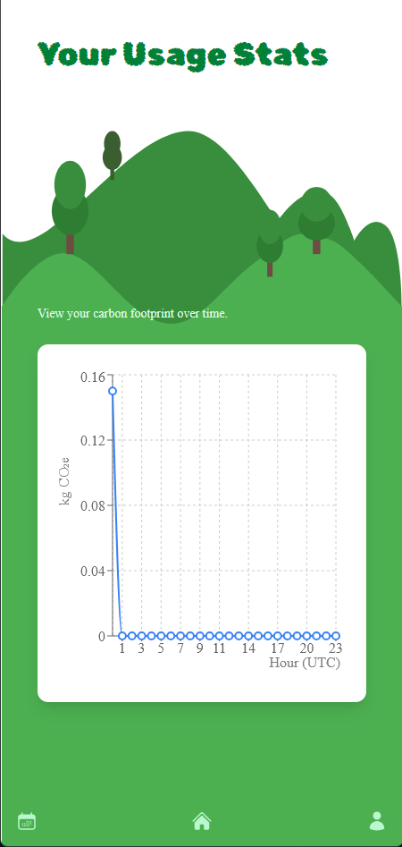

# 🌱 Carbon Tracker – A Gamified Eco Impact App

Carbon Tracker is a mobile-first web app that helps users measure and reduce their carbon footprint through simple daily activity tracking. Inspired by the WeightWatchers system, it gamifies climate-friendly choices using XP, levels, and badges.

Built as a proof of concept to showcase IBM **Watsonx AI** in a modern web environment.

---

## 🚀 Features

- 🌿 **Track Any Activity in Natural Language**  
  → e.g., *"ate 100g of lentils"*, *"drove for 10 minutes"*

- 🧠 **Watsonx AI Estimation**  
  → Calculates `CO₂e_kg`, assigns an impact level (`green`, `amber`, `red`)

- 🎯 **Gamified Progression System**  
  → Earn XP and unlock eco-themed badges  
  → Level up as you log sustainable actions

- 📈 **Stats Dashboard**  
  → View your carbon footprint over time (hourly, daily, monthly)

- 👤 **User Profiles**  
  → See your XP, level, badge grid, and login/logout securely

---

## 💡 Watsonx AI Integration

This project demonstrates:
- **Natural language activity estimation** using Watsonx Text Generation
- **Fallback logic** with Watsonx Embeddings + vector similarity (Vectra)
- A **lightweight RAG-style workflow** without requiring Watson Discovery
- Seamless IBM Cloud token handling using service-based API keys

> 🔍 When a user enters a new activity, Watsonx returns an estimated impact and reasoning. It’s then stored locally so future similar entries are answered instantly.

---

## 🛠️ Stack

**Frontend**
- Vite + React + Tailwind CSS (v4)
- Responsive design with mobile-first layout
- State handled via React hooks

**Backend**
- Node.js + Express (ESM modules)
- `lowdb` for lightweight local JSON-based storage
- `vectra` for vector search with Watsonx embeddings
- IBM IAM token service integration

---

## 📸 Screenshots

| Home Page | Activity Card | Badges | Stats |
|-----------|----------------|--------|--------|
|  |  |  |  |

---

## ⚙️ Local Setup

### 1. Clone the repo

```bash
git clone https://github.com/yourusername/carbon-tracker.git
cd carbon-tracker
```

### 2. Install Frontend

```bash
cd frontend
npm install
npm run dev
```

### 3. Install Backend

```bash
cd ../backend
npm install
node server.mjs
```

### 4. Environment Variables

Create a `.env` file in `/backend`:

```
WATSONX_API_KEY=your_ibm_api_key
WATSONX_PROJECT_ID=your_ibm_project_id
```

---

## ✨ Future Ideas

- AI-powered suggestions to reduce footprint
- Community leaderboard
- Native iOS/Android builds (via React Native or Capacitor)
- OAuth login integration

---

## 🤝 Acknowledgments

- IBM Watsonx AI for the powerful and flexible model APIs
- [vectra](https://github.com/Stevenic/vectra) for simple local vector search
- Icons inspired by Pokémon badges
- Built with love for the planet 🌍

---

## 🧪 Proof of Concept Status

This is a functional MVP meant to demonstrate:
- AI integration with real utility
- Lightweight eco-tracking without friction
- Engaging user experience using gamification

Let us know if you’d like to co-develop, test, or expand the platform!
